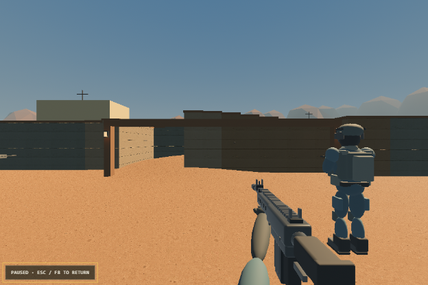
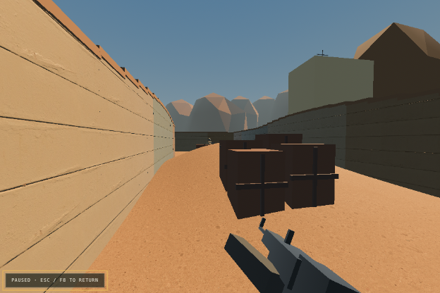

# Dustline: Field Trials

An experimental **Sol + Astra run**: a browser tactical FPS inspired by
**Counter-Strike**, built with Rust, WebAssembly, Bevy and Blender.
An independent AI-assisted development experiment—not affiliated with Valve.

**[Play in your browser](https://soetang.github.io/dustline-field-trials/)** ·
[Watch gameplay](https://soetang.github.io/dustline-field-trials/watch.html) ·
[Download the clip](docs/media/gameplay.webm)



[](https://soetang.github.io/dustline-field-trials/watch.html)

Actual browser captures, not concept art. The silent recording uses Performance
mode on a software renderer; its frame rate is not a gaming-PC benchmark.

## What is playable?

Five-versus-five bomb defusal against bots, first to five rounds. Four weapons,
weapon-specific spread and recoil, economy, reloading, aiming/scope, walking,
crouching, spectating, radar and squad status. The 64 × 48 m desert arena has
three lanes, cover, gentle hills, original operator models and sandstone ridges.

Bots use sight, short-lived contacts, nearby callouts, bursts, cover-aware
repositioning and separate bomb/cover roles. Wounded bots briefly hold their
retreat; teammates no longer steal an active defuse. They scan while advancing,
recenter before tight corners, and detect wall-sliding without route progress.
Travel speed is 3.25 m/s versus the player's 3.65 m/s, with slower combat movement.
They still need tuning.

Use a browser with WebGL2 and hardware acceleration. **Desktop mouse/keyboard
and mobile touch controls are both supported on the same site.** Mobile defaults
to landscape: Deploy requests fullscreen and orientation locking when supported;
otherwise rotate the phone sideways. A rotate-phone prompt holds the round in
portrait, with an explicit portrait fallback. Browser/OS rotation locks cannot
always be overridden ([browser API limitations](https://developer.mozilla.org/en-US/docs/Web/API/ScreenOrientation/lock)).
Use the left stick to move, swipe the view to look, tap the view to fire, or hold
FIRE and drag it to aim while shooting. Another finger can tap to fire while the
first keeps aiming. Tap AIM/CROUCH to toggle. BUY, RELOAD, DEFUSE and PAUSE have
dedicated buttons. Touch play does not require pointer lock. Phones default to
Performance mode with capped render density; real-device performance varies.
No account or installation is needed. This is single-player with bots, not online
multiplayer. The engine file is roughly 45 MB (43.3 MiB) before HTTP compression,
down about 24% by omitting debug function names. Startup streams compilation
without keeping two complete download buffers in JavaScript. Arena/operator art
adds about 3.6 MiB; each equipped first-person weapon loads another 0.4–0.8 MiB
on demand. Actual transfer size depends on the server's compression.
If needed, choose **Escape → Graphics → Performance**, or try the
[classic prototype](https://soetang.github.io/dustline-field-trials/classic.html).

## Open source and open graphics

Original code, procedural models, scenery and interface art are **MIT licensed**.
The editable Blender generators are included. The six external concrete textures
are **CC0 from Poly Haven**; no Counter-Strike/Valve artwork or commercial sound
samples are included. Sounds are synthesized in code.

If mobile sound is silent, open PAUSE → TEST SOUND / ENABLE AUDIO. This retries
the browser audio context and plays two generated tones. Check game/media volume,
silent mode and Bluetooth output if the test remains silent. COPY TEST DETAILS
includes audio state and volume. Where supported, explicit playback uses the
browser's media audio session; no sound files or microphone access are needed.

See [THIRD_PARTY.md](THIRD_PARTY.md), the [asset manifest](assets/manifest.json),
[texture source URLs/checksums](assets/textures/sources.json) and [license notices](licenses).
An unused local texture without documented provenance is excluded from Git and
the published site. Original first-person weapon GLBs include gloved hands,
distinct silhouettes and animated magazines/bolts. Models load when equipped
(about 0.4–0.8 MiB each), use vertex colours without extra texture downloads,
and retain a primitive visual fallback while loading. Blender sources are included.

## Build and run locally

Install Rust through rustup, Node.js (22 recommended) and a Python 3 static server.
The repository pins Rust 1.95 and its WebAssembly target.

```sh
cargo install wasm-bindgen-cli --version 0.2.127 --locked
npm run build
npm run serve
```

Open **http://localhost:8765/bevy.html**. The local root `/` is the classic
prototype. Do not open the HTML as a `file://` URL.

Builds publish a complete immutable JS/Wasm pair to `web/builds/release-*`.
The loader manifest changes only after verification, so refreshing mid-build
cannot mix incompatible releases. Generated releases and tools are not in Git.

## Test and send feedback

```sh
bash scripts/check.sh --source-only       # fast rules, input and model checks
bash scripts/playtest-ai.sh               # 24 complete seeded simulation matches
npm test                                 # after building: also check release/assets
cargo check --target wasm32-unknown-unknown --offline
```

For real browser checks:

```sh
npm ci
npx playwright install chromium
npm run test:browser -- --performance --playtest
npm run test:browser -- --mobile-ui       # fast real-browser touch/layout check
npm run test:browser -- --mobile          # actual Wasm touch gameplay
```

The browser suite exercises actual Wasm gameplay: deployment, mouse capture,
purchases, movement, firing, reloads, aiming, pause/resume and live bot combat.
Simulation tests are not human difficulty ratings, and software rendering is
not representative GPU performance. `--startup-only` checks only startup;
`--ui-only` checks interface behaviour without the game renderer.
Mobile checks use emulation, not a physical phone. Please report your phone model
and browser along with any touch-control or performance problems.

While playing, press **Escape → Copy test details**. Paste that report with what
you tried, what you expected and what happened. It includes the build, match seed,
position, view angles and performance. Nothing is uploaded automatically.

**F8** pauses and hides the HUD for screenshots, including across focus loss.
Escape/F8 returns to the pause menu; choose Return to action to resume.
If image paste is unavailable, save the image and share its local file path.

## Controls

WASD move · mouse aim · left click fire · right click aim/scope · R reload

Shift walk · Ctrl crouch · E hold to defuse · B armory · 1–4 buy

Tab scoreboard · C spectate next teammate · Escape pause · F8 screenshot view

The first seven seconds are preparation: everyone is held in place while you
buy and aim, then a ROUND LIVE cue unlocks movement. Buy at spawn during the
first 20 seconds. Defusing takes five seconds with your
kit. Friendly fire is off; a planted bomb must still be defused after the last
attacker is eliminated. Short bursts and stationary aiming improve accuracy.

## Publish and capture

Push to `main` to build and publish through [GitHub Actions](.github/workflows/pages.yml).
For a fork, enable **Settings → Pages → Source: GitHub Actions** first and update
the public links. The first build compiles Bevy; subsequent builds use a cache.
Release builds omit Wasm debug names; use `KEEP_WASM_NAMES=1 npm run build` when
readable engine stack traces are needed locally.

`node scripts/export-site.js` creates `_site` containing one verified release,
allowlisted assets, media and license notices. If `_site` exists, move it aside
before exporting again. The website root opens the 3D client and `classic.html`
opens the earlier prototype. No backend is required.

After installing Playwright and exporting the site, `node scripts/capture-gameplay.js`
captures actual browser screenshots and a raw silent recording, testing assets
under a repository URL prefix. A smooth, speed-limited mouse driver follows a
walkable route using normal game input. `node scripts/trim-gameplay.js` saves a
short clip beside that session. Each attempt gets its own directory in ignored
`artifacts/video-raw/`, with renderer, frame-timing and movement diagnostics.
Neither command overwrites public media: review the clip before copying it and
the screenshots into `docs/media/`.

Browser tests and captures use portable SwiftShader by default. To use an
available hardware OpenGL driver, set `DUSTLINE_GPU=1`. On this WSL machine,
the Mesa/D3D12 driver still stalls during gameplay even when its NVIDIA adapter
starts successfully. These are local test settings, not flags required by
players. Captures use native pixel density;
`TEST_DPR=0.65` lowers capture resolution on slower hosts. Recorded frame timing
is diagnostic, not a performance guarantee for other devices.

On WSL with Windows Chrome installed in its standard location,
`DUSTLINE_WINDOWS_BROWSER=1 npm run test:browser -- --performance --playtest`
runs the same tests through native Windows graphics. The same environment flag
works with the capture script. The runner creates a fresh temporary profile,
uses a loopback-only debugging bridge, and closes only its own browser. It
does not change your normal browser profile or the deployed game.
Add `--exported` after the test command's `--` to test the already-exported
`_site` build under `/dustline-field-trials/`, including versioned browser scripts
and model/texture loading. This checks the GitHub Pages layout rather than only
the development server's root URL.

`bash scripts/build-capture.sh` builds a separate, development-only engine with
explicit time steps for offline recording experiments. It does not change the
playable release manifest; site checks reject capture-only engines. Smooth
recording is still being developed and is not a real-time performance test.

The native entry point exists (`cargo run --release`), but the browser is the
primary tested client. Native Linux needs Bevy's Wayland/ALSA/udev development
libraries and has not been verified in this workspace.
