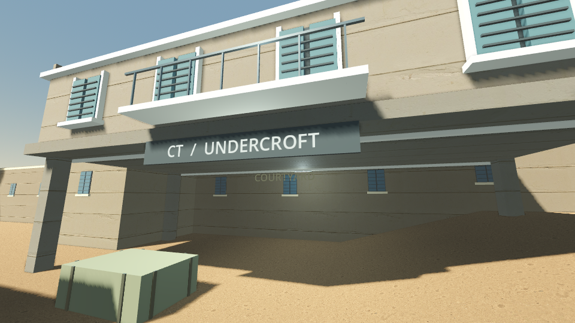

# Courtyard — active edition

**[Play in your browser](https://soetang.github.io/dustline-field-trials/courtyard/)**

Godot 4.7.2 tactical FPS, built as an experimental Sol + Astra run. Original
Dust2-inspired architecture, terrain, operators and procedural animation;
5v5 bot rounds, four weapons, economy, planting/defusing and teammate spectating.
Not affiliated with Valve. Single-player with bots, not online multiplayer.

Browser play needs desktop keyboard/mouse and WebGL2. Native builds use
Forward+; the browser uses Compatibility. High stays the default; lower presets
are explicit visual tradeoffs, not counted as same-quality optimizations.
Animation, AI and performance still need work, including fallen-body wall contact.
The earlier [Bevy edition](../bevy/README.md) supports mobile touch controls.

## Build and play

Commands below run from the repository root:

```sh
npm run setup:courtyard                   # verified portable Godot
npm run play:courtyard                    # Linux native game
npm run setup:courtyard -- --web          # one-time web templates
npm run build                            # isolated browser candidate
npm run serve                            # http://localhost:8765/
```

On Windows, double-click `Play Windows.cmd` in this folder; use
`Play Windows - Compatibility.cmd` for the OpenGL renderer. You can also import
`project.godot` in the pinned Godot editor. Standalone packages:

```sh
bash courtyard/tools/setup.sh --templates
bash courtyard/tools/build.sh
```

The first template setup downloads roughly 1.2 GiB of development tools, never
published. Web candidates live under `builds/web-releases/`; native packages
under `builds/releases/`. Release pointers switch only after verification, so
old working builds remain available. Keep native executables and their `.pck`
together. Do not open web exports as `file://` URLs.

## Controls and feedback

WASD move · mouse look · left/right click fire/aim · R reload · Space jump ·
Shift walk · Ctrl crouch · B armory · 1–4 purchase · hold E defuse · Tab scoreboard ·
Escape pause · F11 fullscreen · F3 diagnostics · F8 save screenshot.

Deploy, buy during the seven-second freeze, then **ROUND LIVE** unlocks action.
After death, left/right click cycles living teammates. First to five rounds wins.
Gun type, stance, movement and firing cadence affect precision.

**Escape → Copy feedback details** includes build, active camera, p50/p95/p99
live frame times, stalls, draw calls and actual render resolution. Compare at
the same window size/settings. F8 downloads a PNG in the browser. Nothing is
uploaded automatically. Sound is synthesized and positional; there is no soundtrack file.

## Targeted verification

```sh
npm run test:courtyard -- --fast
npm run test:courtyard -- pose_reset weapon_walls
npm run test:courtyard -- --list
npm test                                  # all existing headless suites
node courtyard/tests/browser.js --exported # actual exported browser playtest
```

The headless suites exercise real physics, input, combat, AI, clearance, animation
and seeded rounds. They reject error logs even when Godot exits successfully.
Browser playtests and remote visual-review workflows cover rendering separately.
Software-renderer timing is not hardware FPS. Hardware tests require an idle GPU;
never run them while someone is playing. Host-input protection remains in the
shared browser launcher; no normal test should seize the desktop mouse.

[Profiling evidence and reproduction](docs/performance.md) ·
[Experimental engine work](engine/README.md). Experiments are not enabled merely
because their unit tests pass; same-quality whole-frame improvement needs measurement.



[Watch the six-second grounded animation study](docs/grounded-motion.webm): an
offline exact-timestep render, not a continuous gameplay/FPS recording.

## Source and assets

`scripts/` contains focused gameplay systems: `game.gd` coordinates,
`bot.gd` handles AI, `operator_rig.gd` poses characters, `world.gd` builds scenery,
and `render_budget.gd`/`frame_metrics.gd` expose rendering and timing. Tests are in
`tests/`; authoring/export tools in `tools/`; disabled experiments in `engine/`.

Original code, geometry, shaders, models and generated sound are MIT.
Operators are authored by `tools/make_operators.py`; shared first-person weapons
originate in `../bevy/scripts/make-weapons.py`. Textures are unchanged Poly Haven
CC0 assets. No Valve art, commercial audio or proprietary plugins are bundled.
See [asset sources](licenses/ASSET-SOURCES.txt), [texture checksums](assets/textures/sources.json),
[Godot/dependency notices](licenses/) and [LICENSE](LICENSE).
