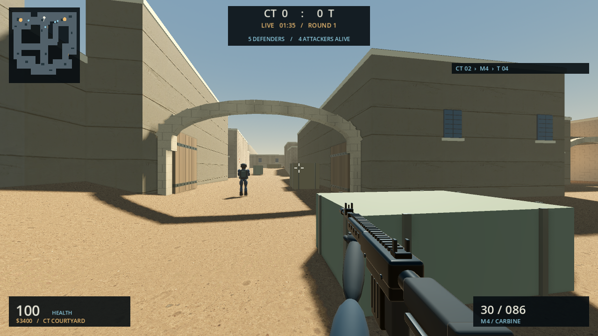
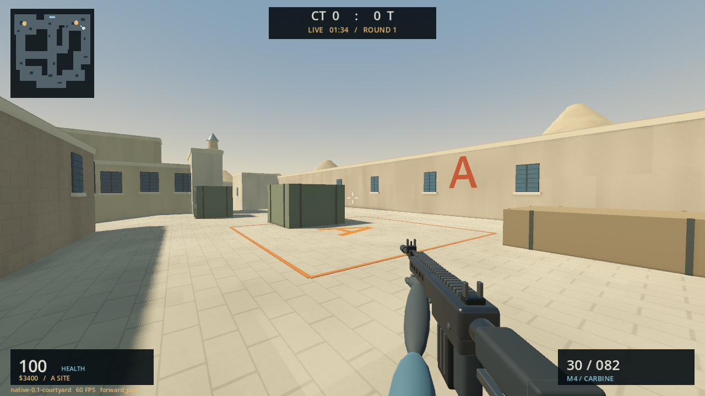
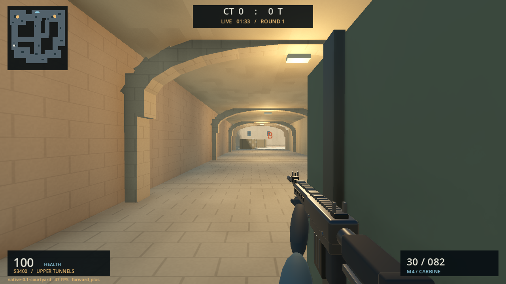
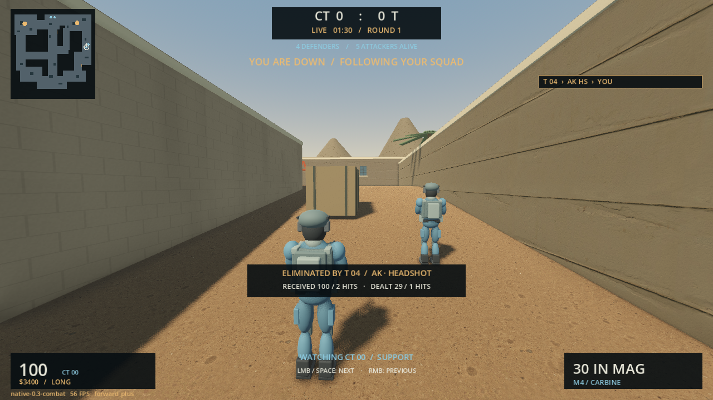

# Dustline Native: Courtyard

A separate tactical FPS experiment using **Godot 4.7.2**, with a native desktop
build and an experimental WebGL2 browser export.
An experimental **Sol + Astra run**, inspired by Counter-Strike's Dust2 route
structure. This is an original single-map interpretation, **not the exact Valve
map**, not an asset extraction, and not affiliated with Valve.

The existing Rust/Bevy browser game stays unchanged in the parent folder and on
GitHub Pages. This project does not require a browser, Unreal, Epic account,
proprietary engine plugins, or commercial asset packs.

## Courtyard browser preview

[Play Courtyard in your browser](https://soetang.github.io/dustline-field-trials/courtyard/).

The same map, rules, AI, weapons and generated sound now export to a
single-threaded WebGL2 build. This preview needs a **desktop keyboard and mouse**;
the [original browser game](https://soetang.github.io/dustline-field-trials/)
continues to support touch controls. Native Forward+ graphics remain available;
the web build uses Godot's lighter Compatibility renderer.

Browser 0.3.1 makes normal bot aim stance-aware and body-focused. Crouching no
longer leaves their aim fixed at standing height. Bots need sustained visible
contact before occasional precision bursts at a slow, exposed target; moving
targets add sideways tracking error rather than a larger headshot lottery.
Weapon damage and headshot multipliers are unchanged, and both bot teams use
the same rules. Standing in an open firing lane is still dangerous.

From the repository root:

```sh
bash native-godot/tools/setup.sh --web
bash native-godot/tools/check.sh
bash native-godot/tools/build-web.sh
node native-godot/tests/browser.js
```

The first setup downloads the official export-template archive (about 1.2 GiB,
development tools only, never published). Builds are separate candidates under
`builds/web-releases/`; `builds/web-candidate.txt` selects the latest export.
No desktop executable, desktop release pointer or existing browser game is replaced.
Serve the candidate directory over HTTP, not `file://`, to play locally.
The first export is about 46.3 MiB uncompressed, or 17.9 MiB using local gzip;
actual HTTP transfer depends on the host. Engine and game pack URLs are pinned
to one immutable release to avoid mixing cached builds.

The browser test serves only the export at a GitHub Pages-style URL without
COOP/COEP headers. It checks actual startup, buy freeze, armory, mouse capture,
move/look/fire/reload, generated audio reaching a running browser audio context,
PNG screenshot download, and pause/resume. Test instrumentation observes audio
and avoids headless pointer warps; it never changes game state or its clock.
The export also has an allowlist, SHA-256 file manifest and size budgets.
The audio meter accumulates real output peaks in an AudioWorklet, so slow
software-rendered frames cannot hide a short sound between main-thread polls.

Automation defaults to Linux headless Chrome, disconnected from the desktop's
X11/Wayland display, so tests cannot trap your mouse. Its FPS is not a hardware
benchmark. Windows headless Chrome can still confine the host cursor; that
runner is blocked unless a tester explicitly sets both
`DUSTLINE_WINDOWS_BROWSER=1` and `DUSTLINE_ALLOW_HOST_INPUT=1`.

In the browser, **F8 downloads a PNG**. **Escape → Copy feedback details** opens
a selectable/copyable text panel; no clipboard permission is required just to
read it, and nothing uploads automatically. First load compiles the engine and
shaders and can take a while. This is an early preview, not a performance promise.



This is the WebGL2 Compatibility renderer during automated keyboard/mouse play,
not native Forward+ or concept art. Browser/mobile graphics and performance
need further tuning; touch controls are not implemented in this preview yet.




Actual native 0.2 renderer screenshots, with staged camera positions for map review.
These are not concept art or a claimed continuous gameplay recording.

Native 0.3 adds teammate spectating and a combat recap:


## Play locally

On the configured Windows machine, double-click **Play Windows.cmd** in this
folder. It uses the standalone build if available, otherwise the portable Godot
installation. Or import `project.godot` in Godot 4.7.2 and press **F6/F5** to run.

The default renderer is **Forward+ / Vulkan**. If the GPU or driver has trouble,
use **Play Windows - Compatibility.cmd** for the lighter OpenGL renderer.

For Linux/WSL development, from the repository root:

```sh
bash native-godot/tools/setup.sh         # pinned, verified portable engine
bash native-godot/Play\ Linux.sh
```

Use native Windows on a Windows/WSL host for graphics; WSL software rendering
is not representative of desktop performance. A packaged build needs no editor.

## Controls and feedback

Press **Enter / Deploy**. The seven-second buy phase freezes everyone, then
**ROUND LIVE** unlocks movement and firing. You play CT with four bot teammates
against five attackers. Defend A/B, or hold E near a planted device for five
seconds to defuse. First to five rounds wins.

| Action | Input |
| --- | --- |
| Move / look | WASD / mouse |
| Fire / aim or scope | Left / right mouse button |
| Reload | R |
| Jump / walk / crouch | Space / Shift / Ctrl |
| Armory / select purchase | B / 1–4 during buy phase |
| Defuse | Hold E near device |
| Scoreboard / pause | Tab / Escape |
| Fullscreen / diagnostics | F11 / F3 |
| Save a screenshot directly | F8 |
| Spectate next / previous teammate after death | Left click or Space / right click |

After death, the camera follows living teammates, retracting at walls. It switches
when the followed teammate dies and returns to your own view next round. Your
damage recap fades after six seconds; hold Tab to recall it. Spectator health,
ammo and radar highlight belong to the followed teammate, not your dead player.

**Escape → Copy feedback details** puts build, renderer, FPS, position, weapon,
health and shot statistics on the clipboard. Paste it with what felt wrong.
**F8** saves a screenshot without needing an external screenshot shortcut;
**Escape → Open screenshots folder** finds the files. Nothing uploads
automatically. Sound is generated noise/tones; there is no recorded soundtrack.
Bot gunfire, footsteps and device beeps are positional, with distance falloff and
wall muffling. Sound follows the spectator camera after death. Your own weapon
and menu/round cues remain centered for clear local feedback.

## First native prototype

- One larger original desert layout: long, mid, short/catwalk, roofed upper/lower
  tunnels, two sites, raised A platform, ramps and separated spawns.
- CC0 scanned concrete surfaces with normal/roughness detail, procedural
  masonry, reinforced open wooden doors, sunlight/shadows, skyline, facades,
  crates, palms, original operator and four first-person weapon models.
- Acceleration and braking, jumping, walking, crouching, recoil, reloads, economy.
  Weapon type, firing cadence, movement and stance all affect precision.
- Radius-aware pathfinding and checked corner/strafe clearance. Bots follow
  routes, scan ahead, react to visible targets, remember/hear contacts, burst,
  reload, plant and defuse. Physics rays block sight and shots at walls.
- Native 0.2 adds one bomb carrier, visible dropped-device recovery, timed and
  interruptible plants, separate defuse/cover roles, and sight-based squad
  backup calls. Bots settle for firing bursts and hold fire behind teammates.
- Rifles are automatic; the AWP and Deagle require a new trigger press. Short
  clicks are queued until the next physics tick; aiming uses the current mouse
  input even when rendering runs at a different cadence.
- Native 0.3 adds wall-safe teammate spectating, damage-exchange recaps, directional
  hit cues, distinct elimination confirmation, living-team counts and a timed
  weapon/headshot kill feed. Hit cues retain the original shot position; they do
  not track an enemy through walls.

This is a playable foundation, not CS2-level art or a finished competitive game.
It is single-player with bots, not online multiplayer. The native gameplay is
new; it does not claim full feature parity with the browser version. No grenades,
networking, exact Dust2 dimensions, Valve art, or recorded weapon sounds.

## Verification

```sh
bash native-godot/tools/check.sh
```

To produce standalone Windows and Linux packages:

```sh
bash native-godot/tools/setup.sh --templates  # first time: 1.28 GB official archive
bash native-godot/tools/build.sh
```

Each build gets a fresh `builds/releases/native-*/` folder, with Windows and
Linux subfolders. Keep each executable and its `.pck` together. Only after the
tests, exports and package startup checks succeed does `builds/current.txt`
switch the launchers to that release. Previous builds—including a running
game—are left intact. The export-template archive is not shipped with the game.
Export templates and the native engine have already been installed on the
configured local machine. No Unreal/Epic software was installed.

The shared game suites include **118 core checks, 47 tactical checks, 20 aim checks, 12 input checks,
33 combat/spectator checks, 15 audio checks and four complete
seeded 5v5 rounds** with a bot replacing the human for equal-team observation.
The tactical tests cover carrier death/recovery, plant interruption, human defuse
ownership, teammate shot obstruction, burst movement and expiring radio contacts.
The seeded checks measure sustained lack of navigation progress independently
of the bots' own replan timer. These samples are not a general difficulty rating.
Windows Forward+ / Vulkan has also been playtested on an RTX 2060. Linux
packages have been smoke-tested headlessly, not visually on a Linux desktop.
Headless input tests exercise synthetic controller events without an OS cursor;
the same input suite also runs in the actual Windows renderer with mouse capture.
The combat suite uses real body/head bullet rays, verifies damage attribution,
teammate-only camera cycling, sphere clearance at a solid wall, death transitions,
pause and round reset. Renderer captures also exercise the spectator HUD.
`tests/audio_mix.gd` separately checks the real desktop engine output: non-silent
gunfire, correct stereo panning, reduced signal through a wall and silence when
muted (four checks). This captures only the game's mixer, never a microphone or
other applications. The fast audio suite checks bounded voice reuse, distance
culling, source placement, pause and spectator listener ownership.
Four render-batching checks cover instance counts, collision-body preservation
and transformed box corners. The initial map groups 1,296 static box details
into 279 local batches while preserving all 47 static collision bodies. Those
are scene counts, not a claim about final draw calls or FPS.

Runs Godot's actual importer, then a fast fixed-timestep headless integration
suite: all key map routes, body clearance, buy freeze, real input movement,
collision, weapon spread/recoil/reload, economy, blocked shots/sight, objective
ownership, generated PCM sound and a live bot round. Both error logs and the
test sentinel are checked because Godot can return exit 0 after a script error.
This is correctness testing, **not a GPU performance benchmark**.

`tests/visual.gd` runs a native renderer smoke test and saves labelled staged
views under `builds/captures`. It exercises movement, shooting and reloading;
the later staged viewpoints are visual tests, not a continuous gameplay clip.

## Open-source provenance

All project code, map geometry, shaders, sounds and original models are MIT
licensed; see [LICENSE](LICENSE). The six GLBs are copies of this repository's
own Blender-authored models, generated by `../scripts/make-operators.py` and
`../scripts/make-weapons.py`. Six concrete surface textures are **CC0 from Poly
Haven**, copied unchanged from the browser project's documented assets. Exact
URLs and checksums are in [the texture manifest](assets/textures/sources.json);
see [asset provenance](licenses/ASSET-SOURCES.txt). There are no third-party audio
files or proprietary graphics. These copies keep the native folder independent
of the browser asset tree.

[Godot is MIT licensed](https://godotengine.org/license/), with open-source
third-party components and bundled font notices in [licenses](licenses).
Official binaries and export templates are pinned to 4.7.2 and verified against
the [official SHA-512 release manifest](https://github.com/godotengine/godot-builds/releases/download/4.7.2-stable/SHA512-SUMS.txt).
Engine/tool binaries, caches and game builds are ignored by Git. The build does
not change system services, file associations, firewall or registry settings.
